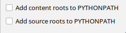

# Pipeline for runnning your solutions

## You should have two terminals opened in ```nti2021-uts/sh``` directory

1. First one will be responsible for running simulation and opening required world file. You have 3 open worlds for testing. You may run: 

    ```./sh/run_simulation.sh 0```

    ```./sh/run_simulation.sh 1```

    ```./sh/run_simulation.sh 2```

    This will open Gazebo GUI for simulation and world with this number.

2. Second one will be responsible for running your scripts. After simulation is loaded, execute your python script as usual. Debugging in PyCharm works as ~~a charm~~ usual, **BUT** requires using a workaround:

When creating launch configuration make sure these checkboxes are unchecked:


